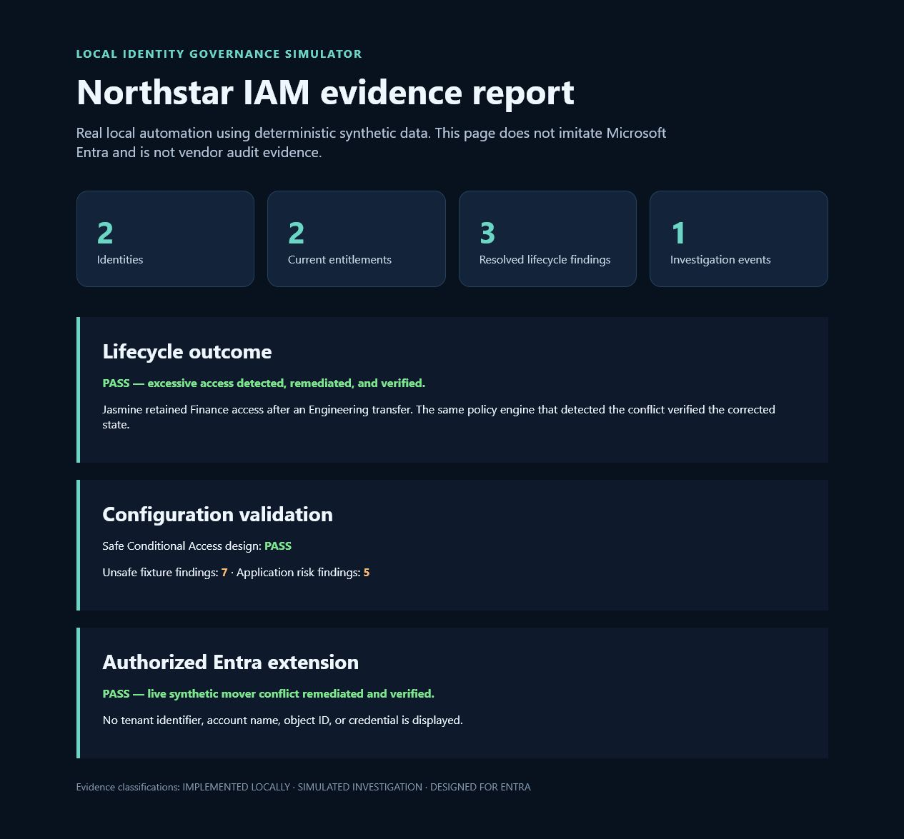

# Microsoft Entra Identity Lifecycle, Access Governance & Zero Trust Lab

[](https://github.com/RyanMFurman/entra-identity-lifecycle-governance-lab/actions/workflows/ci.yml)

> Evidence status: `DESIGNED FOR ENTRA` and `IMPLEMENTED LOCALLY` as phases are completed. No Microsoft tenant deployment is claimed.

This repository is being built phase by phase as a reproducible identity lifecycle and governance portfolio project for the fictional Northstar Health Systems organization.

**Plain-English summary:** when Jasmine moves from Finance to Engineering, an intentional failure leaves her old Finance access in place. The lab detects the excessive access, explains the risk, removes it, and proves the final state is compliant. See [the plain-English project guide](reporting/laymans-guide.md).



The screenshot above is generated from real local execution. It is explicitly a local simulator and does not imitate the Microsoft Entra portal.

```powershell
git clone https://github.com/RyanMFurman/entra-identity-lifecycle-governance-lab.git
cd entra-identity-lifecycle-governance-lab
pwsh ./demo/start-demo.ps1
```

## Current status

The local portfolio MVP is executable: environment assessment, architecture, deterministic identity state, mover and contractor failures, policy findings, investigation evidence, remediation, tests, reporting, CI, reset, and teardown are implemented. Broader Microsoft controls that require tenant licensing remain design or future-validation scope.

See [STATUS.md](STATUS.md), [ENVIRONMENT.md](ENVIRONMENT.md), and [architecture/identity-architecture.md](architecture/identity-architecture.md).

Authorized read-only connection instructions are under `platform/entra/`. Local mode never requires tenant access.

## Skills demonstrated

Identity lifecycle operations · RBAC and entitlement analysis · segregation of duties · access investigation · remediation and verification · Microsoft Graph · PowerShell · Python · SQLite · configuration-as-data · automated testing · GitHub Actions · evidence boundaries.

## Verified evidence

- [Published repository screenshot](docs/screenshots/github-repository.png)
- [GitHub Actions success screenshot](docs/screenshots/github-actions.png)
- [Reproducibility report](reporting/reproducibility-report.md)
- [Expired-contractor investigation](investigations/expired-contractor-investigation.md)
- [Control mapping](compliance/control-mapping.md)
- [Executive summary](reporting/executive-summary.md)

## Planned demonstration

The deterministic primary scenario follows Jasmine Reed from a Finance joiner event through an Engineering transfer. An intentional mover failure retains sensitive Finance access, producing excessive-access and segregation-of-duties findings. The finished lab will investigate, remediate, and verify the corrected state.

## Evidence boundaries

- Local code, state transitions, and tests: `IMPLEMENTED LOCALLY`
- Synthetic event investigations: `SIMULATED INVESTIGATION`
- Microsoft Entra, Graph, Conditional Access, PIM, SSO, and SCIM specifications not deployed to a tenant: `DESIGNED FOR ENTRA`
- Verified operations in an approved tenant, if later performed: `IMPLEMENTED IN AUTHORIZED TENANT/LAB`
- Items requiring licensing or production validation: `FUTURE PRODUCTION VALIDATION`

No real PII, PHI, credentials, tenant identifiers, or vendor audit records belong in this repository.

## License

Released under the MIT License. See [LICENSE](LICENSE).
