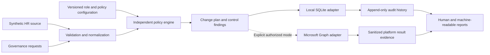
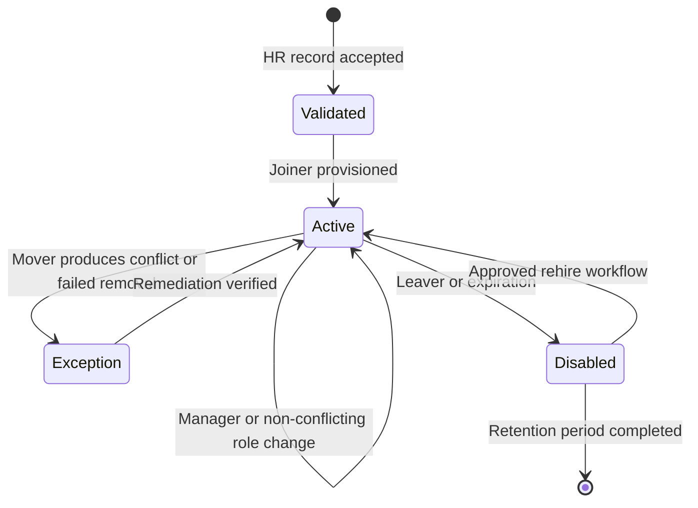

# Northstar Health Systems Identity Architecture

Evidence classification: `DESIGNED FOR ENTRA`

## Project charter

Northstar Health Systems is a fictional healthcare technology company with approximately 1,200 workers. This project designs and locally implements auditable joiner, mover, leaver, access-governance, authentication, privileged-access, guest, and workload-identity controls without using real PII or PHI.

### Objectives

- Make HR-driven identity lifecycle changes deterministic and auditable.
- Grant access through governed roles and entitlements rather than direct assignments.
- remove obsolete access during role changes and termination.
- Detect toxic combinations, expired access, stale guests, and permanent privilege.
- Separate local evidence from authorized Microsoft-platform evidence.
- Preserve reusable policy logic behind local and Microsoft Graph adapters.

### Out of scope at this phase

- Live tenant deployment, license validation, or Graph execution
- Production SSO, SCIM, Conditional Access, PIM, or access-package changes
- Processing real workforce, patient, credential, or tenant data
- Claims of compliance or certification

## Business requirements

1. HR is authoritative for workers, employment status, department, manager, and end date.
2. External guests require an internal sponsor, purpose, and expiration.
3. Access is derived from business role, department, employment type, and privilege level.
4. Movers lose obsolete access before or atomically with receiving conflicting access.
5. Leavers are disabled and stripped of governed access through an auditable workflow.
6. Privileged access is eligible and time limited by default; permanent assignments are findings.
7. Workload identities require owners, least-privilege permissions, and credential lifecycle controls.
8. Emergency accounts are excluded only where required and monitored separately.
9. Every state mutation produces an append-only audit event.
10. Local and authorized-platform execution results can never share an evidence label or output location.

## Personas and identity categories

| Category | Authority and lifecycle | Primary control |
|---|---|---|
| Employee | HR-driven | Role-based access and mover recalculation |
| Contractor/intern | HR or vendor feed with mandatory end date | Automatic expiration |
| Guest | Internal sponsor and resource owner | Access review and expiration |
| Privileged identity | Separate named admin identity | Eligible, approved, time-limited activation |
| Service principal | Application owner | Permission and credential review |
| Managed identity | Azure resource lifecycle | Resource ownership and scoped role assignment |
| Emergency account | Security-owned | Strong authentication, exclusion monitoring, post-use review |
| Shared identity | Exception only | Elimination or migration to named/workload identity |

## Authoritative sources

| Data | Authority |
|---|---|
| Worker status, manager, department, dates | Synthetic HR feed in local mode |
| Guest sponsor and purpose | Guest-governance request |
| Resource ownership | Versioned resource catalog |
| Role and entitlement rules | Versioned policy configuration |
| Current local directory state | SQLite digital twin |
| Microsoft directory state | Microsoft Graph only in authorized mode |

## Trust boundaries and component map

The policy engine is the source of access decisions. Adapters execute normalized plans; they do not contain business-role or segregation-of-duties policy.

## Lifecycle design

## Primary scenario

Jasmine Reed joins Finance and receives approved Finance access. She later transfers to Engineering. A deterministic failure fixture prevents removal of a sensitive Finance entitlement. The control engine detects stale access and a toxic combination, produces an investigation timeline, applies remediation to local state, and verifies compliance.

## Threat model

| Threat | Control direction | Residual concern |
|---|---|---|
| Stale mover access | Desired-vs-actual comparison and atomic recalculation | Source-data delay |
| Expired contractor remains active | Mandatory end date and scheduled validation | Unrecorded extensions |
| Toxic access combination | SoD rules before and after mutation | Incomplete entitlement catalog |
| Permanent administrative privilege | Eligible/time-limited model and findings | Emergency exceptions |
| Guest access persists | Sponsor, expiration, and review | Inactive sponsor |
| Excessive application permission | Permission allowlists and owner review | Vendor permission changes |
| Ownerless workload identity | Minimum owner count and escalation | Departed owners |
| Local evidence mistaken for tenant evidence | Mode isolation and mandatory labels | Human misrepresentation outside the repository |

## Risk assumptions

- HR attributes can be incomplete, late, duplicated, or invalid.
- Group membership alone may not represent all effective access.
- Licenses and tenant capabilities vary and must be discovered before deployment.
- Authentication events do not by themselves prove resource access or misuse.
- Local validation demonstrates control logic, not Microsoft service behavior.

## Recommended local state boundary

The next phase should define normalized SQLite tables for people, identities, groups, memberships, entitlements, licenses, privilege, guests, applications, audit events, findings, remediations, and scenario runs. Stable UUIDs, effective dates, uniqueness constraints, and transactional audit writes will make setup idempotent and remediation defensible.
